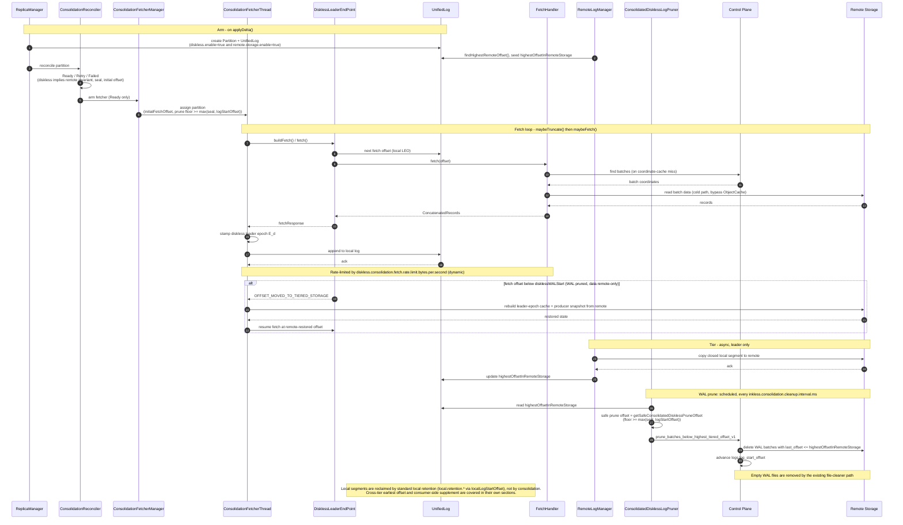
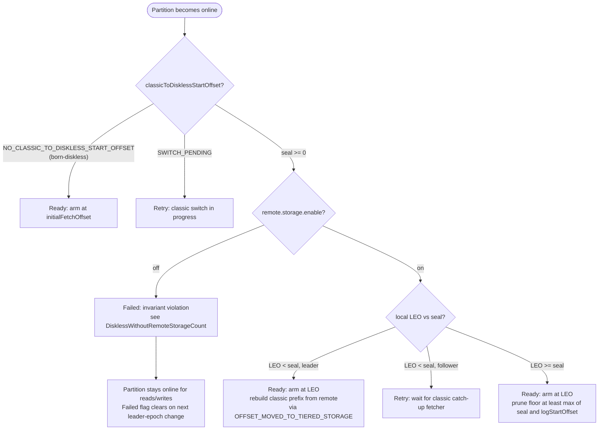

# Tiered storage consolidation

Tiered storage consolidation (TS consolidation) distills diskless Write-Ahead Log (WAL) segments into classic Kafka log segments and tiers them to remote storage. The result is a *consolidated diskless topic* (CDT): a topic that writes through the diskless fast path and reads like a tiered topic. The diskless WAL is a temporary buffer, not long-term storage.

Internally, **TS unification** is the umbrella for three features: [managed replicas](FEATURES.md#managed-replicas), the [classic-to-diskless switch](CLASSIC_TO_DISKLESS_SWITCH.md), and TS consolidation. This document is the consolidation piece.

A consolidated diskless topic has both `diskless.enable=true` and `remote.storage.enable=true`. Origin and consolidation are separate. A *born-diskless* topic is created with `diskless.enable=true` and consolidates only if it is also created with `remote.storage.enable=true`. A *born-classic* topic consolidates after the [classic-to-diskless switch](CLASSIC_TO_DISKLESS_SWITCH.md), which sets both flags atomically, so a switched topic is always consolidating.

The broker gates the feature behind `diskless.remote.storage.consolidation.enable`, which currently defaults to `false`. That flag also requires `diskless.allow.from.classic.enable=true`, managed replicas, and `remote.log.storage.system.enable=true`. Consolidation will be the default going forward.

## Motivation

On a diskless topic, brokers create WAL files to store partition data and nothing more. Those files are write-optimized segments that pack data from many partitions. They are cheap to write. They are worse to read: the broker spends extra compute reassembling a continuous per-partition stream. Classic Kafka paths also expect Kafka log segments.

Rewriting WAL segments into the Kafka log format offloads the diskless coordinator, improves read performance, and keeps the log format Kafka already expects.

Consolidation bounds the diskless metadata that the PostgreSQL coordinator retains. This keeps coordinator resource use and retention cleanup predictable as retained history grows. Continuous background consolidation also reduces bursts of object-storage GET requests when consumers read older data, which stabilizes read latency and lets the cluster sustain lagging consumers more consistently.

## Migration paths

Migration between classic and diskless topics has several cases. This document covers TSU-1/2 and the transitive TSU-3/5 paths. The [classic-to-diskless switch](CLASSIC_TO_DISKLESS_SWITCH.md) and the upstream tiered-storage framework cover the other paths.


The paths are:

- **TSU-1/2** (in scope): A diskless or migrating topic switches to a consolidated diskless topic.
- **TSU-3/5** (in scope): A classic or tiered topic reaches CDT through the migrating or pure-diskless states. TSU-1/2 plus the classic-to-diskless switch enable this path.
- **TS-2 / TSU-4** (out of scope): Disable consolidation and revert a CDT to a pure diskless topic. CDT is a terminal state.
- **TS-4** (out of scope): A diskless-to-classic topic switcher. TS consolidation is a subprocess of that larger problem, and it solves a different one.
- **Classic to tiered**: The remote storage framework already implements this path.
- **Tiered to classic**: KIP-950 is the planned path.

## High-level architecture

### Read-write path

Diskless topics have leaders. Leadership and followers give locality and caching. If every broker is a replica, interconnectedness is high and the cache is inefficient: in the worst case every broker caches the same replica. A single replica is the other extreme. It can work in a small single-region or on-prem install, but fetching from the leader then incurs extra cross-region cost.

The better shape matches the Kafka replica-fetcher model. A leader replica handles produce traffic and replication. The leader or a follower can serve consume traffic (follower fetch). Interconnectedness stays relatively low. Cross-region traffic is avoided, or it moves to bucket-side replication. Caching is more efficient because a cached segment lives only where it is read.

### Consolidation pipeline

Without consolidation, diskless WAL segments are stored in object storage. They remain there until `log.local.retention.ms` elapses, then the broker deletes them.

With consolidation, a fetcher reads the oldest batches from the diskless WAL, in insertion order so ordering is preserved, and appends them to a per-partition `UnifiedLog` through the `Partition` class. The `RemoteLogManager` copies those local segments to remote storage the same way it does for a classic tiered topic. After remote storage confirms a batch, the pruner deletes the matching WAL data.

The fetcher splits interleaved WAL files into per-partition local segments. The `RemoteLogManager` then tiers those segments to remote storage. For the component breakdown, see [Implementation](#implementation).

### Log continuity

In Kafka tiered storage, tiered and local offsets can overlap, as KIP-405 defines. The split between diskless and classic local offsets is similar. Diskless offsets usually overlap local offsets because the local log is a cache, not persistent storage.


Depending on the cleanup schedule, diskless logs may totally overlap local logs and even reach deeper into the tiered offset range. That happens when older segments still hold data that has not been migrated to remote storage, so the broker cannot delete it yet.


That overlap is expected. The broker cleans up diskless segments periodically as it consolidates them. The offset concepts in play are:

| Concept                                       | Where it lives                                                        | Meaning                                                                                                                                             |
| --------------------------------------------- | --------------------------------------------------------------------- | --------------------------------------------------------------------------------------------------------------------------------------------------- |
| Log start offset                              | `UnifiedLog.logStartOffset`                                           | The start of the whole (tiered + local) log. The `RemoteLogManager` advances it as remote segments are deleted.                                     |
| Log end offset (LEO)                          | `UnifiedLog.logEndOffset`                                             | The end of the local consolidated log.                                                                                                              |
| Local log start offset                        | `UnifiedLog.localLogStartOffset`                                      | Used for local retention; decides which local segments to delete.                                                                                   |
| Local log end offset                          | `UnifiedLog.logEndOffset`                                             | The consolidation frontier: offsets up to here have been materialized locally. The fetcher copies offsets above this from the diskless tier.        |
| Classic-to-diskless start offset (the *seal*) | `PartitionRegistration.classicToDisklessStartOffset` (KRaft metadata) | For a switched topic, the boundary between the classic prefix `[0, seal)` and the diskless region `[seal, LEO)`. Born-diskless topics have no seal. |
| Diskless WAL start                            | control plane `logs.log_start_offset`                                 | The WAL prune frontier: the first surviving WAL record. The pruner advances it as batches are confirmed in remote storage.                          |
| Diskless end offset                           | the diskless LEO                                                      | The end of the diskless WAL; effectively the produce high watermark.                                                                                |

### Read path

With consolidation, the broker can serve a consumer fetch from three sources:

- **Tiered offset space**: Classic log segments on remote storage (`[0, highestOffsetInRemoteStorage]`).
- **Diskless offset space**: WAL segments on remote storage.
- **WAL cache**: A local in-broker cache (a subset of the diskless offset space).

`ReplicaManager.fetchMessages` routes a consolidating partition as follows:

- If the fetch offset falls in the tiered range (below `localLogStartOffset`), the broker routes the request to the `RemoteLogManager`, as it does for any tiered topic.
- If the fetch offset is inside the local log, the broker reads the local log. If that read doesn't satisfy `minBytes`, the broker supplements with a synchronous diskless fetch starting at the local log end offset and merges the two through `ConcatenatedRecords.concat`. For the details, see [Consumer-side supplement](#consumer-side-supplement). The supplement avoids parking the consumer in the delayed-fetch purgatory at the local/diskless boundary when diskless data is already available.
- If the fetch offset is at or beyond the local log end offset, the broker serves the request from the diskless subsystem (cache or object storage).

If every partition in the request is consolidating, the broker applies the supplement inline and returns the response immediately. If the request mixes consolidating and pure-diskless partitions, the supplement and the diskless fetch run concurrently in `DelayedFetch.onComplete`, so latency is the slower of the two, not their sum.

#### Consumer-side supplement

```
consumer fetch (offset O, minBytes M)
   |
   +-- read local log [O, localLEO)
         |
         +-- bytes returned < M and O+read reached localLEO?
               |  yes
               +-- synchronous diskless fetch from localLEO
               +-- merge local ++ diskless via ConcatenatedRecords
               +-- return (high watermark and last stable offset taken from the diskless supplement)
         |  no (still inside local log, or error)
         +-- return local result
```

The supplement starts where the local read left off, not at a fixed boundary, and it fires only after the local log is exhausted up to `localLEO`. Supplementing from below the seal would stitch the local prefix directly onto the diskless range and silently drop the committed range `[supplementStart, seal)`. The broker therefore suppresses the supplement there.

#### Remote reads after WAL prune

After a batch is consolidated to remote storage and the WAL is pruned, data below the diskless WAL start lives only in the remote tier. If a fetch targets an offset in `[logStartOffset, disklessWALStart)` — for example after local-log loss, or a follower catching up — `DisklessLeaderEndPoint.fetch` signals `OFFSET_MOVED_TO_TIERED_STORAGE` and clears the records. The stock Kafka tier-state machine then rebuilds the leader-epoch cache and producer snapshot from remote storage before it resumes the WAL fetch.

This is the read-from-remote path that lets a consolidated topic survive losing every local copy.

#### Followers

Followers must never replicate diskless records into their local log. When a partition has fully switched and a follower fetches at or beyond the seal, `fetchMessages` returns an empty response with the high watermark clamped to the seal. The classic fetcher loop then sees the partition as caught up and goes idle. The follower keeps its classic local prefix intact and can still serve consumer reads from it. The consolidation fetcher described in [Implementation](#implementation) is the component that materializes the diskless region into the local log. It runs on managed replicas only.

### Cross-tier log start offset

On a consolidating born-diskless topic, the earliest readable offset eventually lives only in the remote tier: the diskless WAL is pruned and local segments are evicted, yet `ListOffsets(EARLIEST)` must still point at real data. When `retention.ms` expires the oldest remote segments, only the partition's classic leader observes the earliest offset advancing. Its `RemoteLogManager` raises `UnifiedLog.logStartOffset` as it deletes them. That value is broker-local. Followers fetch from the diskless WAL and never learn it, and the control plane's `log_start_offset` tracks only the WAL prune frontier, not the remote-retention frontier.

Without this feature, `ListOffsets(EARLIEST_TIMESTAMP)` (`--time -2`) served by any non-leader broker returned a stale `0`, pointing consumers at data that no longer exists. `EARLIEST_LOCAL_TIMESTAMP` (`--time -4`) is intentionally unaffected: it must keep returning the diskless WAL log start.

The leader is the only participant that knows the cross-tier earliest offset, but any broker must be able to serve it. The control plane is the source of truth, with a short-TTL cache:

- **Write path (leader).** `CrossTierLogStartReporter` buffers per-partition updates, drops non-advancing ones, coalesces, and flushes to the control plane once a second. On success it writes through to the cache. The `RemoteLogManager` callback in `BrokerServer`/`ReplicaManager` triggers it on the leader. It is a no-op for non-consolidating and classic topics, and for strictly negative offsets. `0` is meaningful and is reported: it is the cross-tier earliest of a freshly-tiered consolidating born-diskless topic whose WAL prune frontier has advanced above it.
- **Read path (any broker).** `FetchOffsetHandler` serves `EARLIEST` on a consolidating diskless topic through the `CrossTierLogStartCache` first. On a miss it queries the control plane and populates the cache. `DisklessFetchOffsetRouter` routes `EARLIEST` for every consolidating partition (born-diskless and switched alike) to this control-plane leg, never to the broker-local classic log. That routing is required under managed replicas. `InklessTopicMetadataTransformer` advertises a hash-selected replica (usually a follower) as the partition leader, and a follower's local classic log start is frozen at the switch. Serving `EARLIEST` from that local start would pin the client-visible earliest at a stale value, for example `0` after a `DeleteRecords` the follower never applied. The control-plane value is broker-agnostic, so every broker returns the same cross-tier earliest. Non-consolidating switched partitions keep serving `EARLIEST` from the classic leg while it still owns the pre-switch prefix.
- **Whole-log start and reclaim floor (leader).** The same control-plane value is the authoritative whole-log start and remote-retention reclaim floor for a consolidating partition, not the broker-local `UnifiedLog.logStartOffset`. On a freshly-elected leader whose classic prefix was already evicted, the leadership rebuild pins the local log start at the seal, and that start can only increment. Using it would over-reclaim the remote classic prefix `[earliest, seal)` and reject reads of that prefix as out-of-range. `DisklessLeaderEndPoint` therefore reports `min(X, localLogStart)` as the whole-log start, so a read of the surviving prefix redirects to the remote tier and the tier-state rebuild restarts at `X`. `RemoteLogManager` uses `X` as the log-start-breach reclaim floor and the become-leader report. Both go through `ReplicaManager.crossTierEarliestOffset`, where `X` is `COALESCE(remote_log_start_offset, log_start_offset)`. This runs on the `RemoteLogManager` leader, which under managed replicas differs from the broker that served a `DeleteRecords`, so a broker-agnostic source is mandatory.
- **Cache.** Caffeine-backed with a TTL and a monotonic `put` (a `Null` implementation disables it); owned by `SharedState`. A stale entry can only ever be too low (the safe direction), so it only delays when a retention advance becomes visible off-leader.
- **Storage.** The value is kept in `logs.remote_log_start_offset` (migration `V16`), advanced only forward via `advance_cross_tier_log_start_offset_v1`. `list_offsets_v1` (migration `V17`) returns it for `EARLIEST`, while `EARLIEST_LOCAL` keeps returning `log_start_offset`.

Write pressure is negligible. Remote retention advances rarely (per `RemoteLogManager` expiration cycle). Updates are coalesced per partition and flushed once a second, and only strictly-advancing values are sent.

For configuration and JMX metrics, see [Configuration](#configuration) and [Metrics](#metrics). For system tests that exercise this path, see [Testing](#testing).

## Implementation

The design reuses the replica-fetcher machinery with a custom `LeaderEndPoint` that fetches from the diskless tier instead of from a leader broker. That reuses `UnifiedLog`, `RemoteLogManager`, and `AbstractFetcherThread`, and it keeps the diskless-specific logic isolated.

### Components

| Component                       | Role                                                                                                                                                                                                                                           |
| ------------------------------- | ---------------------------------------------------------------------------------------------------------------------------------------------------------------------------------------------------------------------------------------------- |
| `ConsolidationFetcherManager`   | Custom `AbstractFetcherManager`. Owns `ConsolidationFetcherThread`s; receives partition add/remove from `ReplicaManager`.                                                                                                                      |
| `ConsolidationFetcherThread`    | Extends `ReplicaFetcherThread`. Overrides `toMemoryRecords` (for `ConcatenatedRecords`) and `processPartitionData` (to stamp the diskless leader epoch and update lag metrics).                                                                |
| `DisklessLeaderEndPoint`        | Custom `LeaderEndPoint`. Fetches batch data and offsets from the diskless tier via the shared `FetchHandler`/`FetchOffsetHandler`; implements `OffsetsForLeaderEpoch` against the seal/diskless LEO; signals `OFFSET_MOVED_TO_TIERED_STORAGE`. |
| `ConsolidationReconciler`       | Decides, per partition, whether consolidation can start now (`Ready`), should wait (`Retry`), or cannot (`Failed`).                                                                                                                            |
| `ConsolidatedDisklessLogPruner` | Scheduled job that prunes WAL batches once they are confirmed in remote storage.                                                                                                                                                               |
| `ConsolidationMetrics`          | Per-partition and broker-aggregate lag gauges.                                                                                                                                                                                                 |

`ReplicaManager` wires these components and instantiates them only when `diskless.remote.storage.consolidation.enable=true`.

### Sequence

The implementation adds a reconciler gate, the diskless leader epoch `E_d`, the `OFFSET_MOVED_TO_TIERED_STORAGE` recovery path, and cold-path reads with a dedicated quota. It moves WAL pruning out of the `RemoteLogManager` into a scheduled `ConsolidatedDisklessLogPruner`.



1. On `applyDelta()` in `ReplicaManager`, a partition change starts the process. `ReplicaManager` creates `Partition` objects and `UnifiedLog` objects for diskless partitions where both `diskless.enable=true` and `remote.storage.enable=true`. The `ConsolidationReconciler` decides whether to arm a consolidation fetcher for each.
2. Once armed, the partition is assigned to a `ConsolidationFetcherThread`. The thread's `leader` is a `DisklessLeaderEndPoint`. The fetch loop is the standard `maybeTruncate()` then `maybeFetch()`:
   - `buildFetch()` constructs fetch requests for each partition it fetches.
   - `fetch()` calls the `FetchHandler`, which resolves batch coordinates (from the coordinate cache or the control plane) and batch data (from the Caffeine cache or object storage, via the cold path; see [Cache pollution](#cache-pollution-cold-path)).
   - The thread appends the returned records to the local `UnifiedLog`.
3. The `RemoteLogManager` asynchronously copies closed local segments to remote storage and updates `highestOffsetInRemoteStorage` on the `UnifiedLog`. The `ConsolidatedDisklessLogPruner` then marks the now-tiered WAL batches for deletion in the control plane, advancing the diskless WAL start.

### `ConsolidationReconciler` state machine

The reconciler runs per partition before a fetcher is armed. It enforces the `diskless.enable ⟹ remote.storage.enable` invariant and handles the seal boundary.



A `Failed` partition stays online and remains readable and writable. Consolidation doesn't run, so the local log doesn't grow unbounded into an untiered diskless log. `FailedPartitionsCount` and the controller-side `DisklessWithoutRemoteStorageCount` metric surface the state to operators. If the failure is an invariant violation, set `remote.storage.enable=true` and trigger a leader-epoch change (restart, reassignment, or preferred-leader election) so reconciliation runs again.

### Diskless leader epoch for truncation

Diskless records are produced with leader epoch 0. Appending them after a switched partition's classic prefix (which carries higher classic epochs) would break `LeaderEpochFileCache` monotonicity and disable `OffsetsForLeaderEpoch` divergence truncation.

The controller captures a frozen diskless leader epoch `E_d` at the `initDisklessLog` commit and persists it in KRaft metadata as a tagged field on `PartitionRegistration`. Then:

- `ConsolidationFetcherThread.maybeStampDisklessLeaderEpoch` stamps `E_d` onto each materialized batch in place (the partition leader epoch is outside the batch CRC, so no checksum recompute is needed). Born-diskless partitions with no `E_d` are left at epoch 0.
- `DisklessLeaderEndPoint.fetchEpochEndOffsets` answers `OffsetsForLeaderEpoch` for followers:
  - A queried epoch below `E_d` returns the seal, so a stale classic tail past the seal truncates back to it. Collapsing every classic epoch to the seal is correct because the classic prefix `[0, seal)` is committed and identical across replicas.
  - A queried epoch at or above `E_d` (or a born-diskless partition with no `E_d`) returns the current diskless LEO.

`DisklessLeaderEndPoint.resolveLeaderEpoch` applies the same region logic to list-offsets results, because `FetchOffsetHandler` stamps a placeholder epoch of 0 that cannot be trusted.

> **Upgrade caveat.** Partitions switched before this change carry a seal but no `E_d`, so they fall through to the LATEST-LEO branch and keep the pre-divergence-truncation behavior until they are re-switched. This is a safe fallback, not a correctness regression.

### Cache pollution: cold path

Consolidation reads data that consumers will likely never touch. Routing those reads through the same hot path as consumer fetches would pull WAL data into the Caffeine `ObjectCache` and evict useful entries.

The mitigation is cold-path routing (KC-171), not OS-level page-cache workarounds. The consolidation `Reader` fetches old (lagging) data through `backgroundStorage`, bypassing the `ObjectCache`. Recent data still uses the cache for hits on producer-cached and consumer-cached ranges. The cold path reuses the consolidation data thread pool; it doesn't allocate a separate pool. You can rate-limit it as a safety valve with `diskless.consolidation.fetch.lagging.request.rate.limit`.

> The original design also considered direct I/O, `posix_fadvise(DONTNEED)`, memory-mapped files, and broker separation. None of those OS-level mitigations were implemented. The cold-path approach avoids polluting the Inkless object cache, which is the directly contended resource, without modifying Kafka's I/O layer.

### Fetch quota

Consolidation reads from object storage use a dedicated `ReplicationQuotaManager` (`DisklessConsolidationFetch` quota type), so they aren't mixed into inter-broker replication throttling. `diskless.consolidation.fetch.rate.limit.bytes.per.second` configures it. This is a dynamic broker config. Set it to `0` to pause all consolidation fetches. Set it to `Long.MAX_VALUE` to disable the limit. The reconciler marks consolidating topics throttled when it arms their fetchers, so bytes are recorded to the quota sensor.

## Retention and expiration

Cleanup is asynchronous. Retention time and size configs for diskless topics match Kafka, except for the retention check interval:

|                            | Config                                                     |
| -------------------------- | ---------------------------------------------------------- |
| Retention time (whole log) | `retention.ms`, `log.retention.ms` / `.hours` / `.minutes` |
| Retention time (local log) | `local.retention.ms`, `log.local.retention.ms`             |
| Retention size (whole log) | `retention.bytes`, `log.retention.bytes`                   |
| Retention size (local log) | `local.retention.bytes`, `log.local.retention.bytes`       |
| WAL prune interval         | `inkless.consolidation.cleanup.interval.ms`                |

When remote logs are in play, `retention.ms` and `retention.bytes` are the whole-log expiration (local plus remote), consistent with classic tiered topics. `local.retention.*` keep their existing meaning for the local portion.

![Retention: tiered [0,249], local [250,299], diskless [240,350]. Diskless overlaps both](img/consolidation/retention.png)

### WAL pruning

`ConsolidatedDisklessLogPruner` runs on each broker at `inkless.consolidation.cleanup.interval.ms` (default 5 minutes). For each consolidating partition that is not in `SWITCH_PENDING`:

1. It reads `highestOffsetInRemoteStorage` from the `UnifiedLog` (skips if negative: remote storage is not active yet).
2. It computes a safe prune offset: for born-diskless topics that is `highestOffsetInRemoteStorage`; for switched topics it is `partition.getSafeConsolidatedDisklessPruneOffset(...)`, which never prunes below the seal or the partition's consolidation prune floor.
3. It submits a batch prune request to the control plane (`prune_batches_below_highest_tiered_offset_v1`). The control plane deletes WAL batches with `last_offset <= highestOffsetInRemoteStorage` and advances `logs.log_start_offset`.
4. On success, the partition's consolidation prune floor is advanced (`maybeAdvanceConsolidationPruneFloor`).

The reconciler sets the prune floor to at least `max(seal, logStartOffset)` when it arms consolidation (`ensureConsolidationPruneFloorAtLeast`), so a switched partition's classic prefix is never pruned from the WAL before it is safely in remote storage.

### WAL segment deletion

- The control plane deletes batches that belong to a consolidating topic once their `last_offset <= highestOffsetInRemoteStorage`.
- The existing `mark_file_to_delete_v1` / file-cleaner path removes files that become empty (no remaining batch metadata).

## Reassignment

Because all data is in object storage, reassignment uses the target replicas directly, not a merged original-plus-adding list. When a consolidating partition moves to a new broker, consolidation resumes from object storage: the reconciler arms the fetcher at the current LEO, the fetcher drains the diskless WAL into the local log, and the `RemoteLogManager` tiers it. `InklessConsolidatedDisklessReassignmentTest` covers this end-to-end. When a replica is removed, the broker cleans up its local log on the normal stop-replica path.

## Configuration

Broker-level configs live in `ServerConfigs` (no prefix) and `InklessConfig` (under the `inkless.` prefix). The auto-generated reference is in [configs.rst](configs.rst).

### Feature flag and dependencies

| Config                                         | Default | Meaning                                                                                                                                                                        |
| ---------------------------------------------- | ------- | ------------------------------------------------------------------------------------------------------------------------------------------------------------------------------ |
| `diskless.remote.storage.consolidation.enable` | `false` | Enables the consolidation framework. Requires `diskless.allow.from.classic.enable=true`, `diskless.managed.rf.enable=true`, and `remote.log.storage.system.enable=true`. |

Per topic, consolidation runs when `diskless.enable=true` and `remote.storage.enable=true`. The classic-to-diskless switch sets both atomically. A born-diskless topic consolidates when it is created with both.

### Consolidation fetcher tuning

| Config                                                        | Default                     | Meaning                                                                                                                    |
| ------------------------------------------------------------- | --------------------------- | -------------------------------------------------------------------------------------------------------------------------- |
| `diskless.consolidation.num.fetchers`                         | `1`                         | Number of consolidation fetcher threads (parallelism, independent of `num.replica.fetchers`).                              |
| `diskless.consolidation.fetch.max.bytes`                      | `10 MiB`                    | Max bytes per partition per fetch iteration. Larger values reduce control-plane query frequency.                           |
| `diskless.consolidation.fetch.response.max.bytes`             | `64 MiB`                    | Max total bytes accepted across all partitions in one fetch response.                                                      |
| `diskless.consolidation.fetch.min.bytes`                      | `8 MiB`                     | Min bytes to wait for before returning.                                                                                    |
| `diskless.consolidation.fetch.max.wait.ms`                    | `1000`                      | Max time to wait for `minBytes` when there is little new data.                                                             |
| `diskless.consolidation.fetch.metadata.thread.pool.size`      | `4`                         | Thread pool for control-plane (batch coordinate) queries.                                                                  |
| `diskless.consolidation.fetch.data.thread.pool.size`          | `8`                         | Thread pool for object-storage data fetches (also reused by the cold path).                                                |
| `diskless.consolidation.fetch.find.batches.max.per.partition` | `0` (unlimited)             | Max batch coordinates returned per partition per control-plane query. Larger values improve the coordinate cache hit rate. |
| `diskless.consolidation.fetch.rate.limit.bytes.per.second`    | `Long.MAX_VALUE` (disabled) | Max object-storage read bandwidth for consolidation across all fetcher threads. Dynamic; `0` pauses consolidation.         |
| `diskless.consolidation.fetch.lagging.request.rate.limit`     | `0` (unlimited)             | Max cold-path request rate (requests/sec) as a safety valve.                                                               |
| `inkless.consolidation.cleanup.interval.ms`                   | `300000` (5 min)            | How often the WAL pruner runs on each broker.                                                                              |

### Cross-tier log start offset

| Config                                               | Default | Meaning                                                                           |
| ---------------------------------------------------- | ------- | --------------------------------------------------------------------------------- |
| `inkless.consume.cross.tier.log.start.cache.enabled` | `true`  | Enable the read-/write-through cross-tier earliest-offset cache.                  |
| `inkless.consume.cross.tier.log.start.cache.ttl.ms`  | `10000` | Per-entry TTL; bounds how quickly a retention advance becomes visible off-leader. |
| `inkless.cross.tier.log.start.report.interval.ms`    | `1000`  | How often the leader flushes its observed remote log start offset to the control plane. |

## Metrics

The broker registers these under the `io.aiven.inkless.consolidation` group. The auto-generated reference is in [metrics.rst](metrics.rst).

| MBean                                                           | Attribute                                                   | Meaning                                                                                                                                                                                    |
| --------------------------------------------------------------- | ----------------------------------------------------------- | ------------------------------------------------------------------------------------------------------------------------------------------------------------------------------------------ |
| `io.aiven.inkless.consolidation:type=ConsolidationMetrics`      | `ConsolidationTotalLag`                                     | `disklessLEO - remoteLogEndOffset` (full pipeline: diskless to remote). Broker aggregate; per-partition gauges tagged with `topic`/`partition`. Only updated when remote storage is active. |
|                                                                 | `ConsolidationLocalLag`                                     | `disklessLEO - localLogEndOffset` (first hop: diskless to local).                                                                                                                          |
|                                                                 | `ConsolidationDeletableMessages`                            | Messages already in remote storage, eligible for WAL pruning (`remoteLogEndOffset - localLogStartOffset`).                                                                                 |
| `io.aiven.inkless.consolidation:type=ConsolidationFetchMetrics` | `RecentDataRequestRate` / `LaggingConsumerRequestRate`      | Hot-path (cache-hit) vs cold-path (object-storage) consolidation fetch rates.                                                                                                              |
| `io.aiven.inkless.delete:type=CrossTierLogStartReporter`        | `PartitionsReported` / `ReportErrors` / `PendingPartitions` | Cross-tier log start offset reporting to the control plane.                                                                                                                                |
| `io.aiven.inkless.cache:type=CrossTierLogStartCache`            | `CacheHits` / `CacheMisses` / `CacheSize`                   | Cross-tier earliest-offset cache.                                                                                                                                                          |
| controller                                                      | `DisklessWithoutRemoteStorageCount`                         | Switched topics with remote storage off (invariant violation; surfaces `Failed` reconciler state).                                                                                         |

## Compatibility

- **Produce / consume / replication**: Standard Kafka client APIs. A consolidated topic behaves like a tiered topic for clients.
- **ListOffsets**: `EARLIEST` returns the cross-tier earliest offset (remote + local). `EARLIEST_LOCAL` returns the diskless WAL log start. `LATEST` works as usual.
- **OffsetsForLeaderEpoch**: Supported for switched partitions via the diskless leader epoch `E_d` mapping (epochs below `E_d` map to the seal; `E_d` and above map to the diskless LEO). This enables follower divergence truncation.
- **DeleteRecords**: Supported for hybrid (switched) partitions.
  - *Known limitation (authorization).* When an authorizer is enabled, `DeleteRecords` on a switched or consolidating partition requires the broker's inter-broker principal to be granted `DELETE` on the topic. `InklessTopicMetadataTransformer` advertises a hash-selected replica (usually a follower) as the client-facing leader, so the admin request rarely reaches the real KRaft leader directly. The receiving broker forwards the leader-only leg to it over the inter-broker listener (`DisklessDeleteRecordsForwarder`) as a plain `DeleteRecords`, which the leader authorizes against the forwarding broker's principal, not the original client's. If the broker principal lacks `DELETE` on the topic, the forwarded leg is rejected with `TOPIC_AUTHORIZATION_FAILED` and the operation fails. Deployments where the inter-broker principal is a super-user (the common case) are unaffected. This is accepted for now. The proper fix is wrapping the forwarded request in a KIP-590 envelope so the leader re-authorizes against the original client principal. That requires API changes: enabling the `Envelope` request on the broker inter-broker listener, which today accepts it only on the controller listener, plus a broker-side envelope handler. It is deferred.
- **Transactions**: Transactional offset commits are allowed for diskless sources. Abort markers are preserved for the local portion of a consolidating partition. Transactions that span the consolidation boundary into the diskless portion are not supported: the broker logs a warning and those offsets have no abort markers.
- **Unclean leader election**: Disabled on classic-to-diskless switch (KC-129).

## Testing

Unit tests cover the feature. They include `DeleteRecords` into a switched topic's tiered classic prefix `[0, seal)`, and size-based reclaim via `retention.bytes` on the `RemoteLogManager` whole-log path.

Integration tests cover produce and consume on consolidating topics, reads that cross the local/diskless boundary, concurrent produce during consolidation, a classic-to-diskless-to-consolidated switch, and reassignment that resumes consolidation on a new broker without data loss.

System tests (ducktape) cover consolidating born-diskless topics and switched topics. To run them, see [SYSTEM_TESTS.md](SYSTEM_TESTS.md). They cover the following:

- The pipeline: the WAL drains into the local log and then to remote storage, the WAL is pruned, and every acked record is still consumable. Consolidation JMX gauges are asserted along the way.
- Durability after local loss: once the prefix is remote-only, wiping every partition directory and restarting still serves the full log from remote storage, including a switched topic whose offset 0 was written under a classic epoch.
- Object-store and control-plane outages during produce: the cluster doesn't lose an acked record. After recovery, lag drains and pruning resumes.
- Cross-tier reclaim via `retention.ms`: after the early prefix is remote-only and the topic earliest is still `0`, reclaim advances that earliest, leaves a contiguous surviving tail, and deletes the reclaimed remote objects.

## Related documents

- [FEATURES.md](FEATURES.md#managed-replicas): Managed replicas, the replica-assignment piece of TS unification.
- [CLASSIC_TO_DISKLESS_SWITCH.md](CLASSIC_TO_DISKLESS_SWITCH.md): The classic-to-diskless migration that produces a consolidating topic. Sets `diskless.enable` and `remote.storage.enable` atomically.
- [ARCHITECTURE.md](ARCHITECTURE.md), [GLOSSARY.md](GLOSSARY.md).
